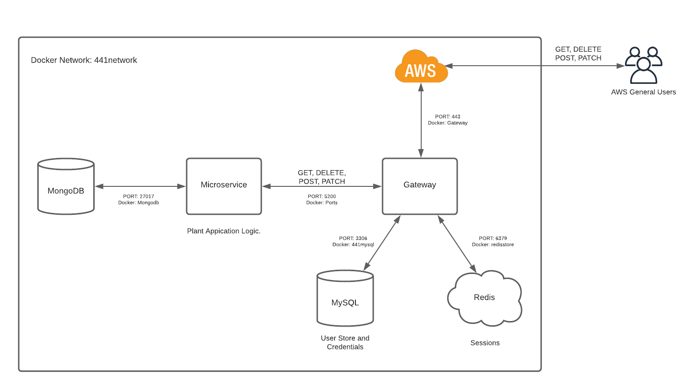

# PlantBuddy
API: https://api.erikth.me/
Client: https://www.erikth.me/

## Project Description
The target audience for our application are all types of plant enthusiasts, from seasoned gardeners to aspiring plant parents. Plant enthusiasts will use this application to learn about different types of plants and share their thoughts or experiences caring for the plant. They can look through different categories of plants and find the right plant for them by learning from others’ experiences.

Our team members all have varying levels of experience with plants (one of our team members just killed his first plant and another has 17 plants!). We as developers want to build this application so that we can learn best practices from other plants owners and create a community where plant owners can learn from each other.


## Technical Description
### Architecture

### User Stories
| Priority | User | Description |
| ----------- | ----------- | ----------- |
P0 | As a user | I want to be able to register and edit the settings in my profile<ul><li>MongoDB Docker container as backend database to store credentials</li><li>Use a redis store to keep track of user sessions</li></ul> |
P0 | As a user | I  want to be able to CRUD posts<ul><li>MondoDB table for posts</li><li>REST API handler that is able to GET, POST, PATCH, and DELETE posts</li><li>Ensures authentication through the Authorization header on the request</li></ul> |
P0 | As a user | I want to be able to comment on posts<ul><li>REST API handler that is able to POST, PATCH, and DELETE a comment</li><li>Array of comments for each post in MongoDB database model</li></ul> |
P1 | As a user | I want to be able to see a summary of characteristics for plants I like and rate plants based on my experiences<ul><li>Utilize existing API for this information</li><li>GET method to get the information</li><li>Separate ratings table for each plant in MongoDB database model</li></ul> |
P2 | As a user | I want to be able to add plants to my profile<ul><li>Backend S3 bucket to store images of plants</li><li>MongoDB connection to S3 bucket</li></ul> |
P2 | As a user | I want to be able to follow people and see the posts that they make<ul><li>Array of followers in MongoDB database model</li><li>PATCH handler that can update users to have a new follower or to follow a new person</li><li>Stretch Goal: Setup websockets for real time communication within the app</li></ul> |

### Endpoints
- GET /posts
  - Get all posts
- GET /posts/plant/{plantID}
  - Get all posts about a specific plant with {plantID}
- POST /posts
  - Create a new post
  - Post content passed in through body
- GET /posts/{postID}
  - Get post with {postID}
- PATCH /posts/{postId}
  - Update post with {postID}
  - Post content passed in through body
- DELETE /posts/{postID}
  - Delete post with {postID}
- POST /posts/{postID}/comment
  - Create new comment under post with {postID}
  - Comment content passed in through body
- PATCH /posts/comment/{commentID}
  - Update comment with {commentID}
  - Comment content passed in through body
- DELETE /posts/comment/{commentID}
  - Delete comment with {commentID}
- POST /users
  - Create new user in user table
  - Credentials are passed in through body
- GET /users/{userID}
  - Get the user with {userID}
- PATCH /users/{userID}
  - Update the user with {userID}
  - Updated credentials passed through request body
- POST /sessions
  - Start new session for the current user
  - Credentials are passed in through the body
- DELETE /sessions/mine
  - End the current user's session

### Data Models
Note: Plant data will be sourced from preconfigured API.  The plantID fields below will contain the id from this outside API.
```
User:
{
  id: string,
  firstname: string,
  lastname: string,
  email: string,
  hashPass: string,
  timestamps: date
}
```

```
Comment:
{
  message: string,
  user: User,
  timestamps: date
}
```

```
Post:
{
  title: string,
  message: string,
  user: User,
  createdAt: date,
  comments: [Comment],
  plantID: string
}
```

```
Rating:
{
  plantID: string,
  difficulty: int,
  live_giving: int,
  expensive: int
}
```